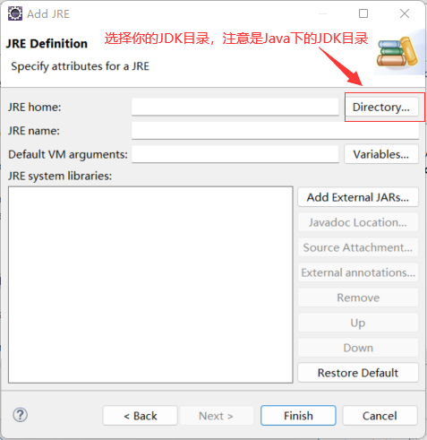
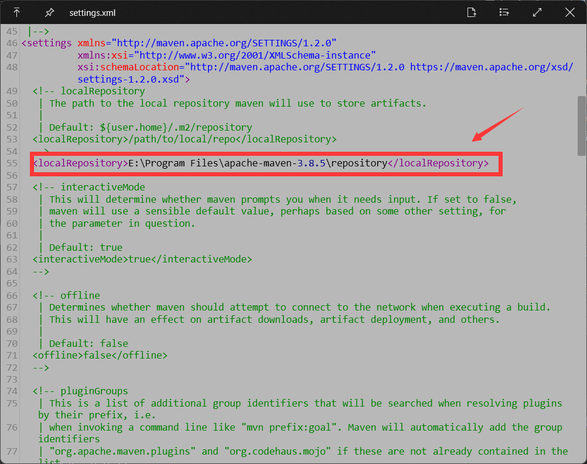

# 图书管理项目

> 一个基于Java Web的图书管理项目

## 1.简介

本项目分为用户和管理员模块。

用户可以进行注册、登录、更改个人信息、借阅书籍、归还书籍、查看个人借阅信息；

管理员可以对图书、借阅、用户进行管理。

## 2.项目用到的技术

- Servlet
- JSP
- MySQL

## 3.软件详细配置

- Intellij IDEA: 2021.2.3 或者 Eclipse IDE: Version: 2022-03 (4.23.0)
- JDK: 1.8
- Tomcat: 10.0.17
- Maven: 3.8.5
- MySL: 8.0.27

### 3.1 Eclipse配置

#### 3.1.1 JDK配置

1. 安装Java8

2. 添加JDK8到Eclipse

    若已经添加跳过此步骤

   - 依次点击Eclipse菜单
   `Window > Preferences > Java > INstalled JREs > Add > Standard VM > Next`
   
   - 然后点击 `Finish`
   - 然后勾选上刚才添加的 `JDK8`
   - 再点击 `Apply and Close` 保存

#### 3.1.2 Tomcat配置
1. 下载Tomcat 10.x.x，解压
2. 点击 `Window > Preferences > Server > Runtime Environmetn`
3. 点击 `Add` 选择 `Apache > Apache Tomcat v10.0` **一定要是版本10的**
4. 点击 `Next` 选择解压的Tomcat10目录， `JRE` 选择 `Workbench default JRE` 点击 `Finish`
5. 点击 `Apply and Close`

#### 3.1.3 Maven配置

1. Maven下载，及解压安装 (自行解决)
2. 依次点击菜单

    - `Window > Preferences > Maven > Installations > Add`
    - 点击 `Directory` 选择Maven解压的目录
    - 点击 `Finish`
    - 勾选刚添加的Maven `apache-maven-3.8.5`
    - 点击 `Apply and Close`
3. 如果Maven没有配置镜像加速，可能后面下载依赖会有点慢
项目路径中有个setting.xml那是Maven的设置文件，可将文件中的如下设置改成你自己的Maven路径即可，
然后将其放到Maven路径下的`conf`目录下。

能下载完依赖并且没有报错，就不需要设置了。

#### 3.1.4 检查项目配置
1. 右键项目点击最下面的 `Properties`
2. 点击 `Properties > Java Compiler` 看看右边的 `Complier compliance level:` 是不是 `1.8`，若不是请将其改成`1.8`
3. 点击 `Properties > Web Project Settings` 看看 `Context root` 是不是 `/`, 若不是请将其改成 `/`
4. 点击`Apply and  Close` 保存设置

#### 3.1.5 导入项目
1. 点击 `File > Import > General > Project from Folder or Archive > Next` 点击 `Durectiry` 选择项目录, 点击 `Finish`
2. 双击打开项目根路径下的`pom.xml`, 右键选择 `Run As > Maven install`
3. 双击打开项目根路径下的`pom.xml`, 右键选择 `Run As > Run Configurations... > Maven Build`，选择和项目同名的选项 `webbms`点击，在右侧 `Goals`输入框中输入`complier`，在点击 `Run`

#### 3.1.6 创建数据库
数据库文件在项目根路径下 `create.sql`，自行解决数据库创建(找个能运行sql的软件就行，navicat等都行，运行整个文件即可)

#### 3.1.7 运行项目
1. 右键项目 `Run As > Run On Server`
2. 第一次创建可能没有服务
   1. 有？点击`localhost`选择你自己的服务器即可
   2. 没有？点击`Manually define a new server` 选择 `Apache > Tomcat v10.0 Server` 如果上面配置好了全局 `Tomcat` 则下面的 `Server runtime environment` 会自动填充，点击 `Finish`
3. 项目已经跑起来

## 4. 访问
1. 用户访问地址: `/`, 数据库创建成功后会有两个用户 `account:2019001, password:123456` 和 `account:2019002, password:123456`
2. 管理员访问地址: `/admin` 默认账户: `account: admin, password: 123456`

Description	Resource	Path	Location	Type
HttpServletRequest cannot be resolved to a type	about.jsp	/webbms/src/main/webapp	line 1	JSP Problem
